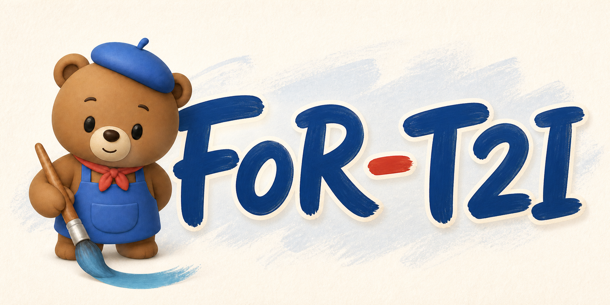
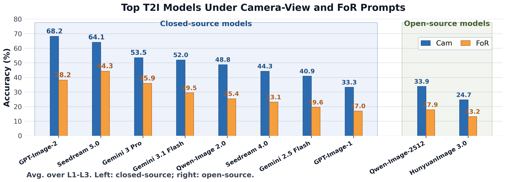
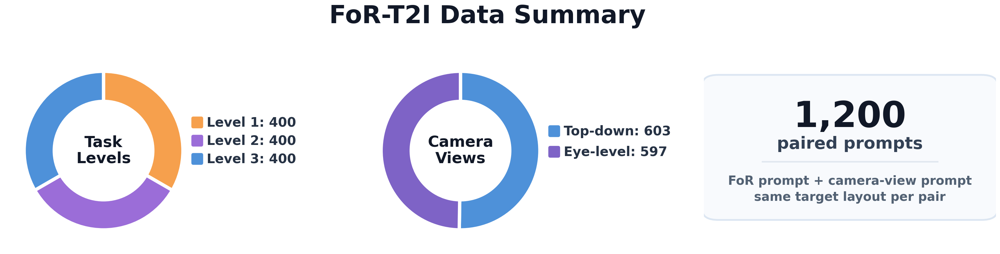
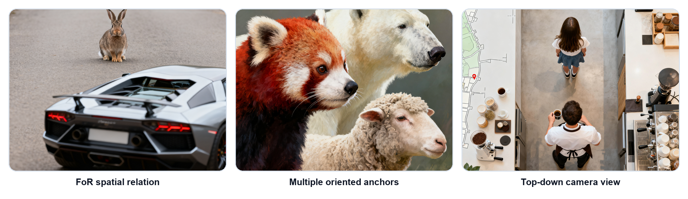

<p align="center">
  
</p>

<h1 align="center">
  Can Text-to-Image Models Draw from the Right Frame of Reference?
</h1>

<p align="center">
  <a href="https://arxiv.org/abs/2608.03357"></a>
  <a href="https://github.com/ernie-research/FoR-T2I"></a>
  <a href="https://ernie-research.github.io/FoR-T2I/"></a>
  <a href="https://huggingface.co/datasets/ernie-research/FoR-T2I"></a>
</p>

<p align="center">
  <a href="https://creativecommons.org/licenses/by/4.0/"></a>
  <a href="https://www.apache.org/licenses/LICENSE-2.0"></a>
</p>

**Left is not always image-left.** If a person is facing the viewer, their left hand appears on the right side of the image. A text-to-image model can therefore render a plausible scene with the requested objects while still drawing the spatial relation from the wrong perspective.

FoR-T2I is the official benchmark release for **[Can Text-to-Image Models Draw from the Right Frame of Reference?](https://arxiv.org/abs/2608.03357)**. It evaluates whether T2I models can follow directional descriptions when the specified frame of reference differs from the camera view.

Each item pairs a frame-of-reference prompt (`FoR_prompt`) with a camera-view control prompt (`Cam_prompt`) that describes the same target layout. This paired design separates ordinary image-coordinate layout ability from the additional difficulty of using an oriented object's own left, right, front, or back. The release contains 1,200 prompt pairs across three difficulty levels, together with structured layout metadata and evaluation tools.

Across 22 recent T2I models, we observe a consistent drop from camera-view prompts to FoR prompts. We also include a training-free mitigation study based on prompt rewriting and VLM-gated visual feedback.

## Results Preview

<p align="center">
  
</p>

## Dataset Summary

<p align="center">
  
</p>

This repository provides prompts and structured layout metadata only; generated model images are not included.

## Examples

<p align="center">
  
</p>

## Usage

```python
from datasets import load_dataset

dataset = load_dataset("ernie-research/FoR-T2I", split="test")
print(dataset[0]["FoR_prompt"])
print(dataset[0]["Cam_prompt"])
```

For local use without `datasets`:

```python
import json
from pathlib import Path

path = Path("data/benchmark_v1_1200/FoR-T2I_1200_prompts.jsonl")
rows = [json.loads(line) for line in path.read_text().splitlines()]
print(len(rows))
```

## Data Fields

| Field | Description |
|---|---|
| `id` | Unique benchmark item identifier. |
| `level` | Difficulty level, one of `L1`, `L2`, or `L3`. |
| `camera_view` | Camera setting, either `top_down` or `eye_level`. |
| `FoR_prompt` | Prompt describing the target layout through the oriented anchor object's frame of reference. |
| `Cam_prompt` | Camera-view control prompt describing the same target layout with direction words from the viewer/image frame. |
| `objects` | Object roles used by the prompt, including anchor and target categories. |
| `layout_result` | Structured layout with coordinates, resolved orientations, and relation metadata. |
| `layout_signature` | Compact evaluation-oriented representation of the same layout. |
| `target_anchor_relation` | Relation of the target relative to the anchor's own orientation. |
| `target_image_relation` | Equivalent target placement in the camera/image frame. |
| `object_orientation` | Required anchor orientation. |
| `orientation_rule` | Orientation-link rule for L3 cases, or `null` otherwise. |
| `split` | Release split identifier. |

## Data Creation

Objects are drawn from existing text-to-image benchmark vocabularies and filtered for concrete, visually recognizable categories with usable orientation cues. Each item stores the resolved layout, camera view, anchor orientation, target relation, and paired prompt texts.

## Evaluation

FoR-T2I can be evaluated with the scripts in the companion GitHub repository. The automatic evaluator uses open-vocabulary detection, segmentation fallback, depth cues, and VLM-based anchor-orientation verification. A prediction is counted as correct only when the required objects are detected, the target spatial relation is satisfied, and the anchor orientation is correct.

Expected generation-result rows follow this format:

```json
{"id": "FoR-T2I-v1-000001", "prompt_kind": "FoR", "image_path": "/path/to/image.png", "status": "ok", "model": "model-name"}
```

`prompt_kind` must be either `FoR` or `Cam`; each benchmark item should have one generated image for each prompt kind.

## Training-free Mitigation

The code for our proposed training-free VLM-gated mitigation method will be released in the next few days. Please stay tuned. 🚀

## Limitations

FoR-T2I is intended for evaluation, not training. Automatic scores depend on the selected detector, segmentation model, depth model, and VLM judge. Published results should report all generation and evaluation settings.

## License

The FoR-T2I benchmark prompts and structured layout metadata are released under Creative Commons Attribution 4.0 International (CC BY 4.0). Code in the companion repository is released under the Apache License 2.0. Third-party models, checkpoints, and services remain under their own licenses and terms.

## Citation

```bibtex
@misc{gu2026texttoimagemodelsdrawright,
  title={Can Text-to-Image Models Draw from the Right Frame of Reference?},
  author={Zheyuan Gu and Ruihang Li and Yong Huang and Yiqian Zhang and Xiangzhao Hao and Jiaxin Niu and Jiahao Hu and Zhenyu Zhang},
  year={2026},
  eprint={2608.03357},
  archivePrefix={arXiv},
  primaryClass={cs.CV},
  url={https://arxiv.org/abs/2608.03357}
}
```
